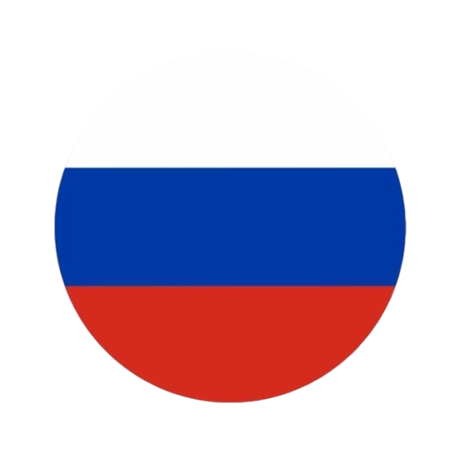

# Handwriter

**Language:**   

---

 *Handwriter* — программа для перевода печатного текста в рукописный вид с возможностью создания собственных шрифтов из вашего почерка. Проект генерирует готовые векторные файлы (SVG) и управляющий G-код для автоматического рисования на ЧПУ-плоттерах.

## Редактор шрифтов (Создание шрифта)

Чтобы создать шрифт из вашего почерка, на вкладке **Шрифт** нажмите кнопку **Редактор шрифтов**. В открывшемся окне вам будут доступны следующие инструменты:

### Работа с символами (Левая панель)
* **Поиск**: Поле для быстрого поиска нужного символа в вашем шрифте.
* **Список символов**: Отображает все добавленные в шрифт символы и количество их вариантов. Вы можете нажать правой кнопкой мыши по любому символу, чтобы **Удалить** его.
* **Добавление символа**: Внизу левой панели введите один символ (букву, цифру или знак препинания) в текстовое поле и нажмите кнопку **"+"**, чтобы добавить его в свой шрифт.

### Холст и рисование (Центральная панель)
* Выберите символ в левой панели, чтобы начать рисовать. Нарисуйте маленькую букву в выделенной клетке. Буквы могут выходить за пределы выделенной клетки, например у БОЛЬШИХ БУКВ верхняя часть на одну клетку выше; у букв у, р, д нижняя часть на одну клетку ниже. Все буквы должны быть примерно одинакового размера.
* **Рисование символов**: Зажмите **левую кнопку мыши** (или используйте графический планшет) и ведите курсор по холсту, чтобы нарисовать символ.
* **Точки соединения**: Для того чтобы буквы слитно соединялись друг с другом при генерации текста, им нужны точки соединения. При нажатии **правой кнопкой мыши** по определённой точке на символе, появится меню для установки **начала** и **конца** символа. Начало - это место, куда будет вести линия соединения от предыдущего символа. Конец - это место, откуда будет начинаться линия соединения к следующему символу. Точки начала и конца можно перетаскивать мышью. Точки соединения ставить не обязательно, для знаков препинания и цифр они не нужны.

### Варианты символа и управление холстом (Нижняя панель под холстом)
* Чтобы текст выглядел естественно, каждой букве можно нарисовать несколько разных вариантов. При генерации будет каждый раз выбираться случайный вариант символа.
* **Стрелки влево/вправо (`<` и `>`)**: Переключение между нарисованными вариантами текущего символа.
* **Кнопка "+" (Добавить вариант)**: Добавить новый пустой вариант для текущего символа.
* **Кнопка корзины (Удалить вариант)**: Удалить текущий вариант.
* **Кнопка ластика (Очистить)**: Стереть все нарисованные линии на текущем варианте.
* **Кнопки лупы (+ / -)**: **Увеличить** или **Уменьшить** масштаб холста.
* **Кнопка "Вместить"**: Подогнать масштаб так, чтобы символ помещался в окне.

### Лента редактора шрифтов (Верхняя панель)
* **Файл**:
  * **Новый шрифт**: Создать пустой шрифт.
  * **Открыть**: Открыть существующий шрифт (`.hfont`).
  * **Сохранить**: Сохранить текущий шрифт.
  * **Сохранить как**: Сохранить текущий шрифт под новым именем.
* **История**:
  * **Отменить**: Отменить последнее действие (рисование или удаление).
  * **Повторить**: Вернуть отмененное действие.
* **Точки соединения**: Показывает координаты добавленных начальной и конечной точек.

## Главное окно приложения

Главное окно разделено на редактор текста (слева) и предпросмотр результата (справа). Сверху располагается лента управления с несколькими вкладками.

### Вкладка "Главная"
* **Файл**:
  * **Создать документ**: Создать пустой проект документа.
  * **Открыть**: Загрузить ранее сохраненный документ (`.hwdoc`).
  * **Сохранить**: Сохранить текущий документ.
  * **Сохранить как**: Сохранить документ под другим именем.
* **История**: 
  * **Отменить / Повторить**: Отменяет или повторяет действия в редакторе текста.
* **Буфер обмена**: 
  * **Вырезать**, **Копировать**, **Вставить**: Функции работы с текстом.
* **Шрифт**:
  * **Открыть шрифт**: Выбрать файл шрифта `.hfont` для текущего документа.

### Вкладка "Шрифт"
* **Шрифт**:
  * **Открыть шрифт**: Выбрать файл шрифта `.hfont` для текущего документа.
  * **Редактор шрифтов**: Открыть окно редактора шрифтов.
  * **Закрыть шрифт**: Убрать текущий шрифт из документа.
* **Размер**:
  * **Размер шрифта**: Настройка масштаба букв. 1.0 - масштаб как в редакторе шрифтов, 2.0 - в два раза больше, 0.5 - в два раза меньше.
  * **Интервал**: Расстояние между строками текста в миллиметрах (мм).
* **Выравнивание**:
  * **По левому краю**, **По центру**, **По правому краю**: Форматирует выделенный текст. При нажатии текст оборачивается в BB-коды (например, `[center]...[/center]`).

### Вкладка "Бумага"
* **Шаблон**:
  * **Загрузить шаблон**: Загрузить готовые настройки размеров и полей (`.hwpap`).
  * **Сохранить шаблон**: Сохранить текущие настройки размеров и полей в файл `.hwpap`.
* **Размер бумаги**:
  * **Ширина** и **Высота**: Настройка физического размера листа в миллиметрах.
* **Поля**:
  * **Верхнее**: Отступ от верхнего края.
  * **Перв. верхнее**: Отступ от верхнего края, который применяется только для первой страницы документа, переопределяет значение поля **Верхнее**.
  * **Нижнее**: Отступ от нижнего края.
  * **Левое** и **Правое**: Отступы по бокам.
  * **В клетках**: Переключает режим измерения полей из миллиметров (мм) в клетки (кл). Размер одной клетки - 5 мм.
* **Превью**:
  * **Показать клетки**: Включить или отключить отображение сетки из клеток на холсте справа.

### Вкладка "Экспорт"
* **Экспорт в SVG**: Открывает окно для выбора папки, куда будет сохранена каждая страница документа в отдельный файл `.svg`.
* **Экспорт в G-code**: Открывает окно для выбора папки, куда будут сохранены файлы G-кода для использования на плоттерах. В разделе "Параметры G-code" можно задать параметры:
  * **Рабочая подача**: Скорость перемещения с опущенной ручкой (мм/мин).
  * **Скорость перемещения**: Скорость перемещения с поднятой ручкой (мм/мин).
  * **Скорость опускания**: Скорость поднятия/опускания ручки (мм/мин).
  * **Z-Up (Перемещение)**: Высота подъема ручки при перемещении без написания (мм).
  * **Z-Down (Рисование)**: Высота опускания ручки, при котором она касается бумаги (мм).

### Прочие элементы управления

* **Текстовый редактор (Слева)**: В это поле можно вводить, вставлять и редактировать текст. Показываются номера строк, текущая строка подсвечена. Вы можете использовать горячие клавиши: `Ctrl+Z` (Отменить), `Ctrl+Y` (Повторить), `Ctrl+S` (Сохранить).
* **Холст предпросмотра (Справа)**:
  * Можно перемещаться по холсту, зажав левую кнопку мыши.
  * Масштабирование происходит с помощью зажатого **Ctrl + Колесико мыши**, либо через кнопки в правом нижнем углу холста: **Уменьшить (-)**, **Увеличить (+)**, и **Вместить**.
* **Строка состояния (В самом низу окна)**: Здесь отображаются уведомления. Например, если в загруженном шрифте отсутствуют символы, написанные в редакторе. Или если есть ошибки в bbcode-тегах.
